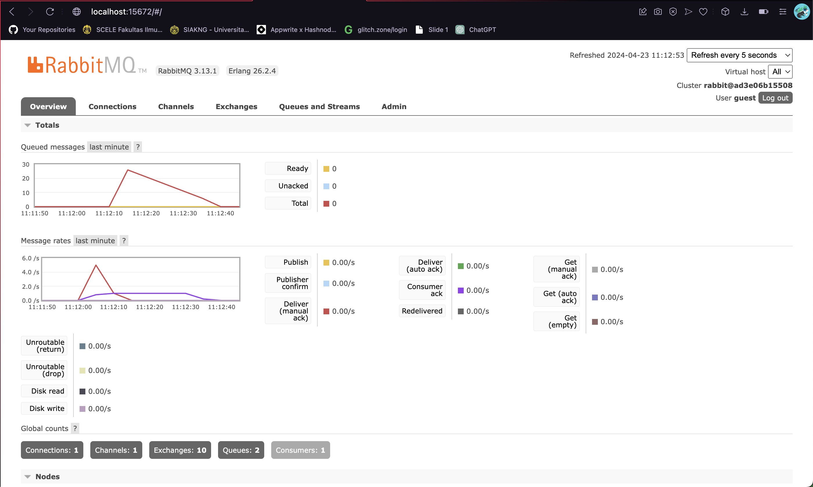

# Understanding subscriber and message broker reflection

1. what is amqp?
Advanced Message Queuing Protocol (AMQP) merupakan open standard protocol yang memungkinakan pengiriman pesan antar sistem terlepas dari platform yang digunakan. Fungsinya, agar pada hubungan sistem-sistem memberikan pesan business processes dengan informasi yang diperlukan untuk mencapai tujuan melalui internet dan cloud.

2. what it means? guest:guest@localhost:5672 , what is the first guest, and what is the second guest, and what is localhost:5672 is for?
- guest:guest@localhost:5672 dalam konteks ini merepresentasikan URL yang memberikan koneksi kepada amqp message broker.
- guest pertama merepresentasikan username dan guest kedua merepresentasikan password yang digunakan untuk kombinasi login pada ampq message broker. guest:guest merupakan kombinasi default untuk login dengan basic access.
- localhost:5672 merupakan hostname dan nomor port dari message broker. Dalam konteks ini message broker dijalankan pada lokal dan mendengarkan pada port 5672 untuk koneksi.

#### Simulation slow subscriber

Queue pada chart saya terdapat 25 queue hal ini terjadi karena terdapat antrean 25 data yang akan diterima oleh subscriber, menumpuknya data ini disebabkan oleh kelambatan subscriber dalam menerima messages. Selain itu, tepat 25 karena saya melakukan tun pada publisher sebanyak 5 kali yang artinya saya mengirimkan 25 data(5 data per run).